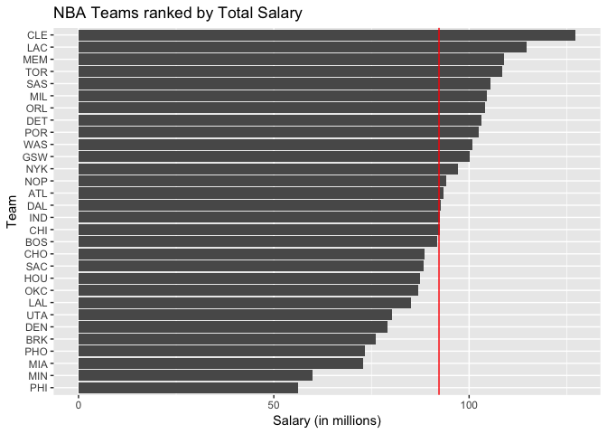
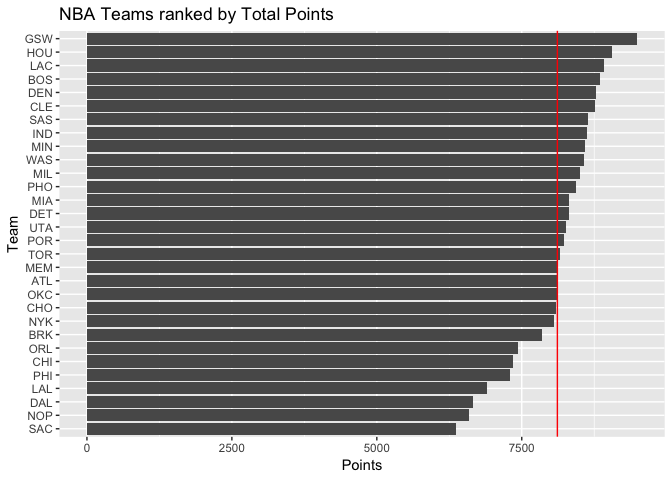
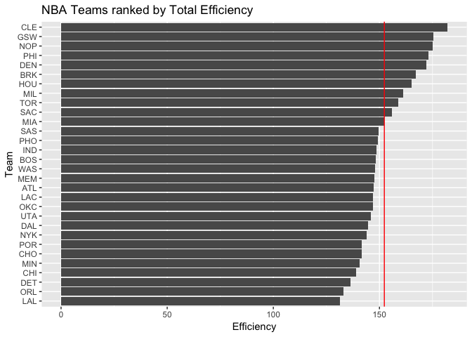
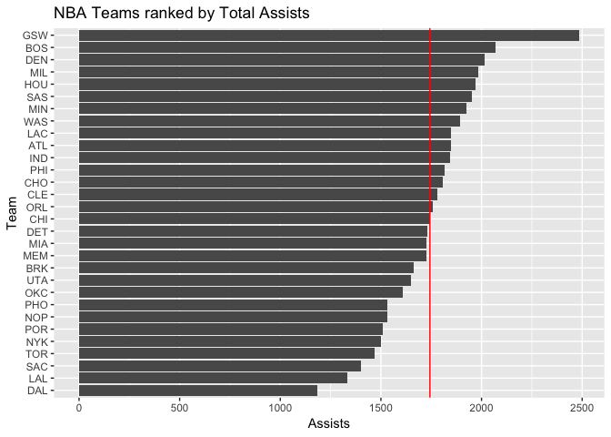

workout01-mindy-dai
================
Mindy Dai
10/5/2018

``` r
library(ggplot2)
```

    ## Warning: package 'ggplot2' was built under R version 3.4.4

``` r
library(dplyr)
```

    ## Warning: package 'dplyr' was built under R version 3.4.4

    ## 
    ## Attaching package: 'dplyr'

    ## The following objects are masked from 'package:stats':
    ## 
    ##     filter, lag

    ## The following objects are masked from 'package:base':
    ## 
    ##     intersect, setdiff, setequal, union

``` r
library(readr)
```

``` r
nba <- read_csv("/Users/mindydai/hw-stat133/workout1/data/nba2018.csv", 
                col_names=TRUE)
```

    ## Parsed with column specification:
    ## cols(
    ##   .default = col_integer(),
    ##   player = col_character(),
    ##   number = col_character(),
    ##   team = col_character(),
    ##   position = col_character(),
    ##   height = col_character(),
    ##   birth_date = col_character(),
    ##   country = col_character(),
    ##   experience = col_character(),
    ##   college = col_character(),
    ##   salary = col_double(),
    ##   field_goals_perc = col_double(),
    ##   points3_perc = col_double(),
    ##   points2_perc = col_double(),
    ##   effective_field_goal_perc = col_double(),
    ##   points1_perc = col_double()
    ## )

    ## See spec(...) for full column specifications.

``` r
nba$experience <- replace(nba$experience, nba$experience == 'R', 0)
nba$experience <- as.integer(nba$experience)
nba$salary <- nba$salary / 1000000
nba$position <- factor(nba$position)
levels(nba$position) <- c('center', 'power_fwd', 'point_guard', 
                  'small_fwd', 'shoot_guard')
nba <- mutate(nba, missed_fg = nba$field_goals_atts - nba$field_goals, missed_ft = nba$points1_atts - nba$points1, rebounds = nba$off_rebounds + nba$def_rebounds)
```

    ## Warning: package 'bindrcpp' was built under R version 3.4.4

``` r
efficiency <- (nba$points + nba$rebounds + nba$assists + nba$steals + nba$blocks - nba$missed_fg - nba$missed_ft - nba$turnovers) / nba$games
nba <- mutate(nba, efficiency = efficiency)
```

``` r
experience <- summarise(group_by(nba, team), experience = sum(experience))
salary <- summarise(group_by(nba, team), salary = sum(salary))
points3 <- summarise(group_by(nba, team), points3 = sum(points3))
points2 <- summarise(group_by(nba, team), points2 = sum(points2))
points1 <- summarise(group_by(nba, team), points1 = sum(points1))
points <- summarise(group_by(nba, team), points = sum(points))
off_rebounds <- summarise(group_by(nba, team), off_rebounds = sum(off_rebounds))
def_rebounds <- summarise(group_by(nba, team), def_rebounds = sum(def_rebounds))
assists <- summarise(group_by(nba, team), assists = sum(assists))
steals <- summarise(group_by(nba, team), steals = sum(steals))
blocks <- summarise(group_by(nba, team), blocks = sum(blocks))
turnovers <- summarise(group_by(nba, team), turnovers = sum(turnovers))
fouls <- summarise(group_by(nba, team), fouls = sum(fouls))
efficiency <- summarise(group_by(nba, team), efficiency = sum(efficiency))

teams <- merge(experience, salary, by.x='team', by.y='team')
teams <- merge(teams, points3, by.x='team', by.y='team')
teams <- merge(teams, points2, by.x='team', by.y='team')
teams <- merge(teams, points1, by.x='team', by.y='team')
teams <- merge(teams, points, by.x='team', by.y='team')
teams <- merge(teams, off_rebounds, by.x='team', by.y='team')
teams <- merge(teams, def_rebounds, by.x='team', by.y='team')
teams <- merge(teams, assists, by.x='team', by.y='team')
teams <- merge(teams, steals, by.x='team', by.y='team')
teams <- merge(teams, blocks, by.x='team', by.y='team')
teams <- merge(teams, turnovers, by.x='team', by.y='team')
teams <- merge(teams, fouls, by.x='team', by.y='team')
teams <- merge(teams, efficiency, by.x='team', by.y='team')
teams
```

    ##    team experience    salary points3 points2 points1 points off_rebounds
    ## 1   ATL        100  93.40559     660    2337    1453   8107          832
    ## 2   BOS         63  91.91509     985    2183    1536   8857          744
    ## 3   BRK         70  76.21567     777    2040    1444   7855          689
    ## 4   CHI         59  92.50189     565    2162    1330   7349          865
    ## 5   CHO         63  88.50477     808    2089    1497   8099          621
    ## 6   CLE        145 127.25458    1030    2148    1384   8770          735
    ## 7   DAL         65  92.82830     712    1754    1007   6651          521
    ## 8   DEN         83  79.02822     868    2351    1477   8783          872
    ## 9   DET         55 103.07449     631    2638    1140   8309          908
    ## 10  GSW        113 100.24256     982    2545    1455   9491          770
    ## 11  HOU         70  87.39233    1140    2011    1623   9065          857
    ## 12  IND         95  92.62084     709    2512    1467   8618          742
    ## 13  LAC        124 114.77662     841    2401    1586   8911          738
    ## 14  LAL         65  85.12544     582    2069    1021   6905          789
    ## 15  MEM         90 108.94584     757    2176    1489   8112          880
    ## 16  MIA         63  72.94438     799    2349    1217   8312          856
    ## 17  MIL         83 104.64657     720    2462    1413   8497          723
    ## 18  MIN         48  59.87827     599    2607    1580   8591          932
    ## 19  NOP         78  94.03547     519    1956    1128   6597          580
    ## 20  NYK         59  97.10692     636    2445    1262   8060          962
    ## 21  OKC         55  86.98136     611    2380    1511   8104          936
    ## 22  ORL         62 104.11034     618    2178    1232   7442          707
    ## 23  PHI         39  56.29336     718    1960    1225   7299          690
    ## 24  PHO         73  73.28258     569    2554    1615   8430          882
    ## 25  POR         43 102.48876     847    2148    1386   8223          706
    ## 26  SAC         77  88.27720     562    1838     998   6360          525
    ## 27  SAS         99 105.39553     753    2469    1440   8637          821
    ## 28  TOR         57 108.45847     626    2359    1570   8166          847
    ## 29  UTA         71  80.32319     791    2242    1401   8258          771
    ## 30  WAS         57 100.78591     718    2526    1368   8574          806
    ##    def_rebounds assists steals blocks turnovers fouls efficiency
    ## 1          2676    1846    645    381      1201  1432   147.2123
    ## 2          2698    2069    617    340      1037  1686   148.2395
    ## 3          2697    1664    568    382      1212  1620   167.0333
    ## 4          2419    1746    605    339       956  1275   139.0978
    ## 5          2615    1806    543    316       820  1177   141.5019
    ## 6          2673    1779    483    304      1020  1356   182.0806
    ## 7          2063    1183    507    257       674  1229   144.6322
    ## 8          2660    2015    543    286      1102  1475   172.2445
    ## 9          2838    1732    574    310       932  1467   136.4089
    ## 10         2869    2486    782    554      1179  1581   175.3384
    ## 11         2608    1969    617    331      1113  1473   165.2848
    ## 12         2702    1844    669    409      1087  1597   148.7141
    ## 13         2790    1848    612    347      1022  1626   147.0737
    ## 14         2213    1334    510    267       972  1444   131.4561
    ## 15         2582    1725    629    335       993  1798   147.5533
    ## 16         2648    1728    579    464      1019  1647   152.1863
    ## 17         2589    1984    666    436      1096  1660   161.2450
    ## 18         2516    1924    641    368      1085  1620   140.7781
    ## 19         2248    1531    502    380       828  1168   175.1662
    ## 20         2592    1499    526    451       975  1584   143.9152
    ## 21         2628    1610    595    395      1133  1561   146.9182
    ## 22         2452    1760    546    305       987  1445   133.1438
    ## 23         2354    1816    613    375      1197  1573   172.9546
    ## 24         2464    1531    588    385      1171  1887   149.2347
    ## 25         2428    1508    522    342       978  1581   141.7957
    ## 26         1876    1402    506    232       850  1303   155.8247
    ## 27         2777    1954    655    484      1057  1498   149.7043
    ## 28         2535    1469    620    379       932  1609   158.7556
    ## 29         2774    1651    550    410      1060  1545   145.8056
    ## 30         2564    1893    655    325      1062  1643   147.8051

``` r
ggplot(data = teams, aes(x = reorder(team, salary), y = salary)) + geom_bar(stat='identity') +
  coord_flip() +
  ggtitle('NBA Teams ranked by Total Salary') +
  labs(x = 'Team', y = 'Salary (in millions)') +
  geom_hline(yintercept = mean(teams$salary), color = 'red')
```



``` r
ggplot(data = teams, aes(x = reorder(team, points), y = points)) + geom_bar(stat='identity') +
  coord_flip() +
  ggtitle('NBA Teams ranked by Total Points') +
  labs(x = 'Team', y = 'Points') +
  geom_hline(yintercept = mean(teams$points), color = 'red')
```



``` r
ggplot(data = teams, aes(x = reorder(team, efficiency), y = efficiency)) + geom_bar(stat='identity') +
  coord_flip() +
  ggtitle('NBA Teams ranked by Total Efficiency') +
  labs(x = 'Team', y = 'Efficiency') +
  geom_hline(yintercept = mean(teams$efficiency), color = 'red')
```



``` r
ggplot(data = teams, aes(x = reorder(team, assists), y = assists)) + geom_bar(stat='identity') +
  coord_flip() +
  ggtitle('NBA Teams ranked by Total Assists') +
  labs(x = 'Team', y = 'Assists') +
  geom_hline(yintercept = mean(teams$assists), color = 'red')
```



I used assists as my index as I believe it is a good measure of team cohesiveness, which I think is very important to seeing how "good" a team is.

-   Was this your first time working on a project with such file structure? If yes, how do you feel about it? Yes, this was. I feel more educated on how to navigate my file system.

-   Was this your first time using relative paths? If yes, can you tell why they are important for reproducibility purposes? No, this was not my first time using relative paths. They are important as the names of directories leading up to your directory might change.

-   Was this your first time using an R script? If yes, what do you think about just writing code (without markdown syntax)? Yes, this was. I found it a bit weird as I had to check my console for the output, but I did get used to it.

-   What things were hard, even though you saw them in class/lab? Navigating my file system was a little bit hard.

-   What was easy(-ish) even though we haven’t done it in class/lab? Using "sink" was easy(-ish) as you just had to figure out the syntax.

-   Did anyone help you completing the assignment? If so, who? No.

-   How much time did it take to complete this HW? 2 hours.

-   What was the most time consuming part? Figuring out how to make the plots.

-   Was there anything interesting? I thought using R Script instead of R Markdown was interesting.
